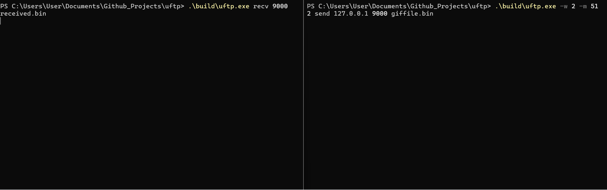

# uftp

A UDP file transfer tool written in C. It implements its own selective-repeat sliding window instead of using TCP, so window size, retransmits, and timing are all visible and tunable.

Built for local networks. Works on Windows and Linux.

This is a learning and demo project — not a replacement for scp, rsync, or SMB in production.

## Demo

<p align="center">
  
</p>

<p align="center"><sub>Loopback transfer with the live dashboard: send window, receive buffer, throughput sparklines, and event log.</sub></p>

## Features

- **Selective-repeat sliding window** — numbered chunks, reorder buffer, cumulative + selective ACKs, timeout retransmits
- **Live terminal UI** — watch packets move through send/receive windows (ANSI by default; optional ncurses)
- **Whole-file CRC32** — sender hashes before transfer; receiver verifies after write
- **Tunable transfer** — `-w` / `--window` and `-m` / `--mss` on the sender
- **Loss simulation** — `--drop` randomly discards incoming packets for testing recovery

## Quick start

**1.** Build the project (see [Build](#build) below).

**2. Receiver** (terminal 1)

```bash
./build/uftp recv 9000 received.bin
```

**3. Sender** (terminal 2)

```bash
./build/uftp send 127.0.0.1 9000 myfile.bin
```

Both sides print transfer stats when finished. Look for `verify: OK` on the receiver.

For a transfer between two machines, use the receiver's LAN IP instead of `127.0.0.1`. The UDP port must be open in the firewall.

## Requirements

- C11 compiler (GCC, Clang, or MSVC)
- CMake 3.16+
- On Windows: Winsock (linked automatically)
- Optional: ncurses for an alternate terminal UI backend

## Build

### CMake (recommended)

```bash
cmake -B build
cmake --build build
```

On Windows with Visual Studio:

```powershell
cmake -B build
cmake --build build --config Release
```

Output: `build/uftp.exe` (Windows) or `build/uftp` (Linux/macOS).

If ncurses is found, CMake enables it automatically. Otherwise the UI uses ANSI escape codes (Windows Terminal, most Linux terminals).

### gcc without CMake

**Linux**

```bash
mkdir -p build
gcc -std=c11 -Wall -Wextra -Iinclude -o build/uftp \
  src/common.c src/codec.c src/net.c src/window.c src/fileio.c src/stats.c \
  src/opts.c src/ui.c src/sender.c src/receiver.c src/main.c
```

**Windows (MSYS2)**

```powershell
mkdir build -Force
gcc -std=c11 -Wall -Wextra -Iinclude -o build/uftp.exe `
  src/common.c src/codec.c src/net.c src/window.c src/fileio.c src/stats.c `
  src/opts.c src/ui.c src/sender.c src/receiver.c src/main.c -lws2_32
```

Add `-DUFTP_HAS_NCURSES` and link `-lncurses` (or `-lncursesw` on Linux) if ncurses is installed.

## Usage

```text
uftp [options] send <host> <port> <file>
uftp [options] recv <port> <output_file>
```

### Options

| Option | Default | Description |
|--------|---------|-------------|
| `--no-ui` | off | Plain text progress instead of the live dashboard |
| `--ui` | on | Live terminal UI |
| `--drop <pct>` | 0 | Drop `pct`% of incoming packets (0–100, for testing) |
| `-w`, `--window <n>` | 64 | Max packets in flight (1–64, sender only) |
| `-m`, `--mss <n>` | 1400 | DATA chunk size in bytes (512–1400, sender only) |

Window and chunk size are negotiated in the HELLO handshake. The receiver adopts whatever the sender announces.

### Examples

Plain output (scripts, CI):

```bash
./build/uftp --no-ui send 127.0.0.1 9000 myfile.bin
```

Smaller window and chunks:

```bash
./build/uftp --no-ui -w 16 -m 512 send 127.0.0.1 9000 myfile.bin
```

Simulate 10% packet loss on the receiver (drops incoming DATA):

```bash
./build/uftp --no-ui --drop 10 recv 9000 received.bin
./build/uftp --no-ui send 127.0.0.1 9000 myfile.bin
```

Simulate ACK loss on the sender:

```bash
./build/uftp --no-ui recv 9000 received.bin
./build/uftp --no-ui --drop 10 send 127.0.0.1 9000 myfile.bin
```

Start with 5–10% loss. Higher rates may require multiple retries or fail if control packets are dropped.

## Terminal UI

Refreshes at roughly 30 fps. See the [demo](#demo) above, or run:

```bash
./build/uftp recv 9000 received.bin
./build/uftp -w 16 -m 512 send 127.0.0.1 9000 myfile.bin
```

| Panel | Contents |
|-------|----------|
| Send window | Up to 64 slots: pending, in-flight, acked, retransmit |
| Recv buffer | Up to 64 slots: empty, next expected, buffered, gap |
| Throughput | Sparkline and Mbps (current and peak) |
| Event log | Handshake, gaps, retransmits |

**Sender:** `.` pending · `>` in-flight · `+` acked · `!` retransmit

**Receiver:** `.` empty · `=` next expected · `#` buffered · `_` gap · `+` delivered

## Protocol

40-byte header (magic, type, session id, sequence, ack fields, CRC) plus up to 1400 bytes of payload per DATA packet.

| Message | Role |
|---------|------|
| HELLO | Sender opens session; announces file size, window, and MSS |
| HELLO_ACK | Receiver accepts |
| DATA | One numbered file chunk |
| ACK | Cumulative ack + 64-bit selective ack bitmap |
| FIN / FIN_ACK | Close session; FIN carries expected CRC, FIN_ACK reports verify result |

The sender pipelines up to 64 packets (tunable with `-w`). Missing ACKs trigger per-packet retransmit with exponential backoff.

## Benchmarks

Sample loopback results on Windows (16 MB file, `127.0.0.1`, no packet loss):

| Config | Throughput | Retransmits | Verify |
|--------|------------|-------------|--------|
| default (w=64 mss=1400) | 295.99 Mbps | 0 | OK |
| window=16 | 286.23 Mbps | 0 | OK |
| mss=512 | 140.21 Mbps | 0 | OK |
| w=16 mss=512 | 142.39 Mbps | 0 | OK |

Reproduce on Windows:

```powershell
powershell -ExecutionPolicy Bypass -File scripts/bench.ps1
```

Loopback throughput is not representative of real LAN performance. Actual speed depends on NIC, wired vs Wi-Fi, and firewall rules. No comparison against scp or SMB is included yet.

To benchmark on a LAN, run sender and receiver on separate machines and compare tools with the same file size:

```bash
# Machine A
./build/uftp --no-ui recv 9000 received.bin

# Machine B
./build/uftp --no-ui send <machine-a-ip> 9000 testfile.bin
```

## Limitations

- No resume after interruption
- No authentication or encryption
- CRC32 detects accidental corruption, not tampering
- Sequence numbers are `uint32_t` without explicit wrap handling for very large files

## Project layout

```
include/uftp/   Public headers (protocol, window, sockets, UI)
src/            Implementation
docs/           README assets (demo GIF)
scripts/        Benchmark helpers
CMakeLists.txt
```

| Module | Role |
|--------|------|
| `protocol.h` / `codec.c` | Packet format and header CRC |
| `window.c` | Send and receive sliding windows |
| `net.c` | Cross-platform UDP sockets |
| `sender.c` / `receiver.c` | Transfer state machines |
| `ui.c` | Live terminal dashboard |
| `opts.c` / `main.c` | CLI parsing and entry point |

## Roadmap

- [x] Terminal UI for packet flight and buffer state
- [x] Whole-file CRC32 verification
- [x] CLI flags for window size and chunk size
- [x] Loopback benchmarks
- [ ] Resume support
